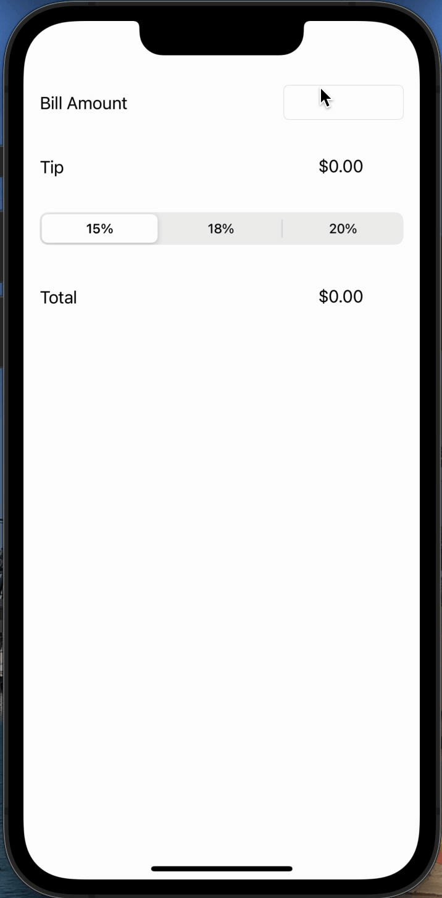

# CodePath PreWork
 
# Pre-work - Tip Calculator

This repo is a tip calculator application for iOS.

Submitted by: Nathanuel Dixon

Time spent: 1 hour spent in total

## User Stories

The following functionality is complete:

* [x] User can enter a bill amount, choose a tip percentage, and see the tip and total values.
* [x] User can select between tip percentages by tapping different values on the segmented control and the tip value is updated accordingly
## Video Walkthrough

Here's a walkthrough of implemented user stories:

GIF created with [Online Converter](https://www.onlineconverter.com/mov-to-gif).

## Notes

Describe any challenges encountered while building the app.

## License

    Copyright 2022 Nathanuel Dixon

    Licensed under the Apache License, Version 2.0 (the "License");
    you may not use this file except in compliance with the License.
    You may obtain a copy of the License at

        http://www.apache.org/licenses/LICENSE-2.0

    Unless required by applicable law or agreed to in writing, software
    distributed under the License is distributed on an "AS IS" BASIS,
    WITHOUT WARRANTIES OR CONDITIONS OF ANY KIND, either express or implied.
    See the License for the specific language governing permissions and
    limitations under the License.
